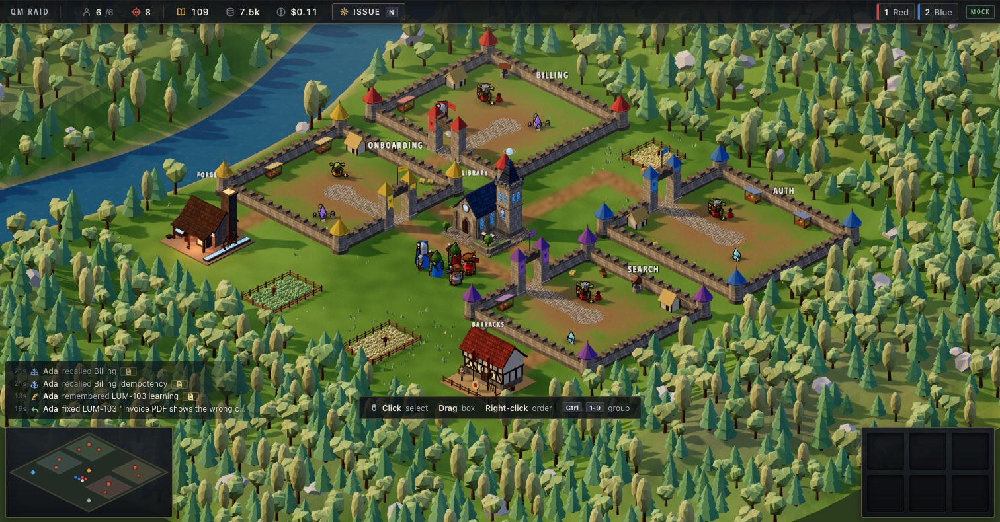
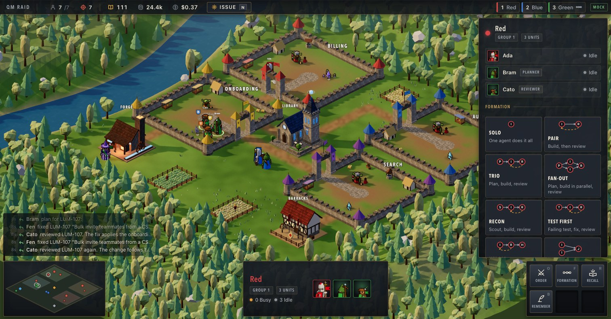
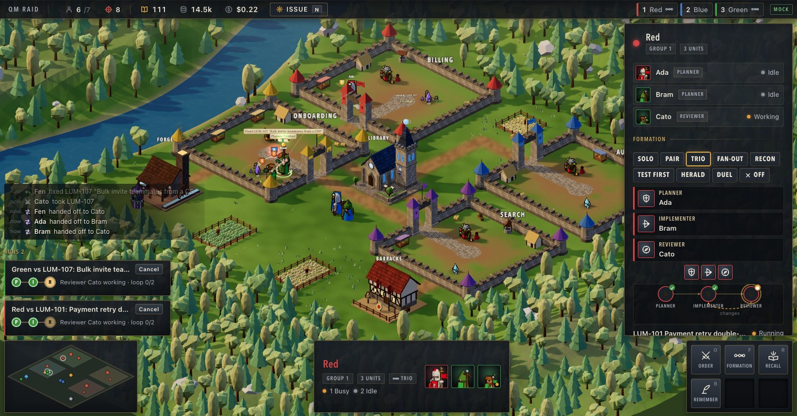
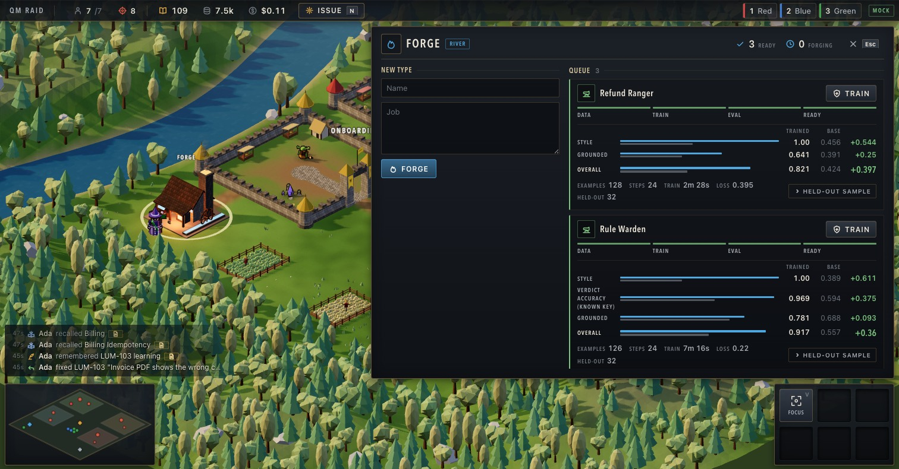
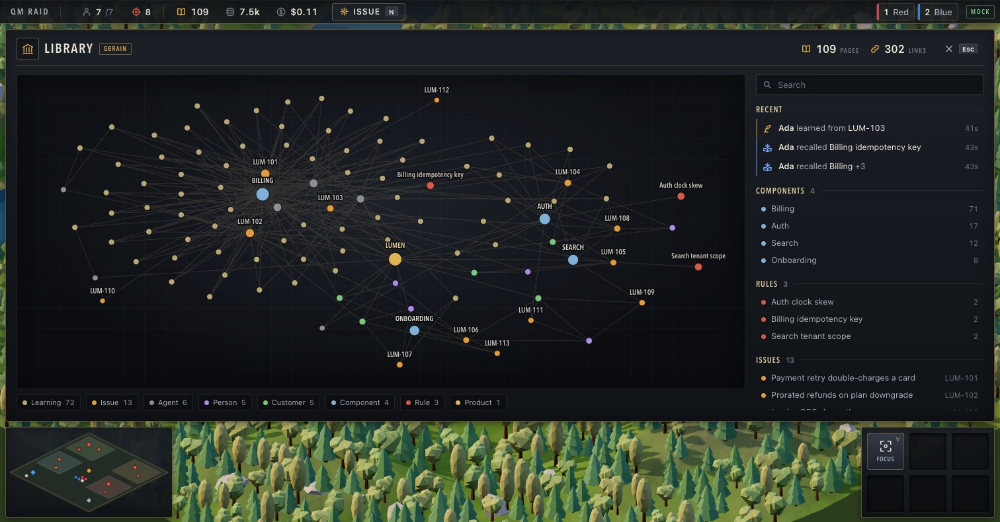
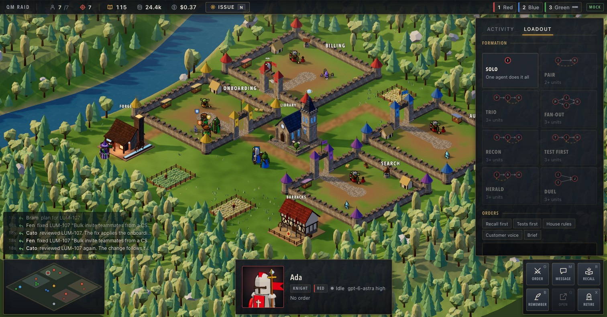

# QM Raid

An RTS-style agent board for [QM](https://github.com/yc-software/qm) swarms, with [GBrain](https://github.com/garrytan/gbrain) as the shared memory the agents consult and grow.

## Screenshots

Captured on the test board (mock engine with synthetic replies) with the full art on. The demo board runs the same interface against real QM agents.

**The map**
- Each product component is a walled district. Open issues are monster camps sized by severity; Issue (N) spawns a new one.
- Units are QM agents on Codex models (knights, rangers, scouts, plus types forged with River). Click or drag to select, Ctrl+1..9 for control groups, right-click a camp to send them.
- GBrain use is visible: a blue beam from the Library when an agent recalls, a gold orb back into it when it remembers.
- Autopilot proposes orders; each waits 15 seconds for Cancel, Adjust or Go before it runs.

**Teams and formations**
- Select two or more units and press Formation (F) to make them a team.
- Pick one of eight workflow presets: Solo, Pair, Trio, Fan-out, Recon, Test first, Herald, Duel. Each card shows its graph.
- Assign roles by clicking a slot and then a unit, or by dragging a portrait; role badges float over the units on the map.

**A workflow run**
- Right-click a camp with the team selected: planner, implementer and reviewer take turns on the issue, each as its own QM agent.
- The reviewer ends with VERDICT: APPROVED or VERDICT: CHANGES. Changes loop back to the implementer until the loop limit, then the run asks for you.
- Run cards show the node chain, the active role and the loop count.

**The Forge (River)**
- Describe a new kind of agent. The Forge generates synthetic training data, fine-tunes Qwen/Qwen3.5-9B with LoRA on River, and evaluates it against the base model on held-out cases.
- Each type shows its stage, per-metric trained vs base bars and training stats. Refund Ranger scores 0.82 against 0.42 for the base; Rule Warden 0.917 against 0.557 on 32 held-out review cases.
- Train sends a unit of the new type out of the Forge, and it takes orders like any other unit.

**The Library (GBrain)**
- The graph of GBrain pages and links: components, rules, issues, customers, and the learnings the agents wrote back.
- Recent shows who recalled or remembered what; the index lists components, rules and issues. Search, or click any node to read its page.

**Loadout**
- Standing orders become the unit's QM system prompt and are restated in every order it gets.
- Toggle QM skills (Debug, Write tests, Code review and more) and pick the model and effort. GBrain is always on.

Issues appear as targets on a 2.5D isometric map, agents are units you select, group and order like an RTS, and GBrain is the Library building: agents raise their staffs to recall from it and send learnings back into it. The Forge is a River building: describe a new kind of agent, it generates synthetic training data, fine-tunes a model with River, and you train units of that new type from it. Autopilot proposes orders with a short veto window.

Built during the Own Your Intelligence Hackathon (YC, San Francisco, 2026-09-27) by a swarm of coding agents. See `docs/` for the plan and the contract between services, and `services/` and `apps/` for the components. All data is synthetic.
